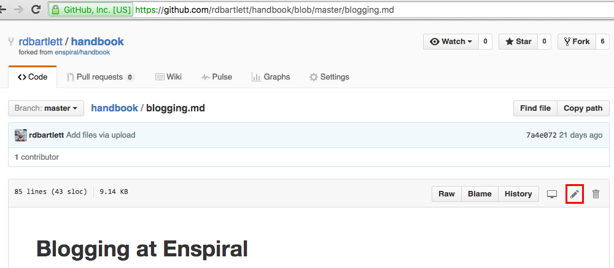
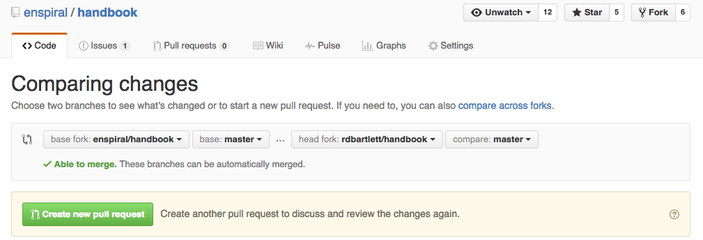

# Contributing to the handbook

## The Github Method

Github is a platform that is mostly used by developers to manage software projects: it allows many contributors to all work on a single project without stepping on each other's toes. It has a system for storing files and proposing changes to them in a managed way. (This is based on an amazing free technology called git.)

All the files that make up this handbook live on Github: [https://github.com/enspiral/handbook](https://github.com/enspiral/handbook)

If you have a Github account, you can propose changes to the handbook in a way that allows other people to comment on the changes before they are accepted. While these changes are pending, they're called a "pull request". A repo maintainer can accpet the changes by "merging" them in.

To change an agreement you need to follow the process outlined in the [decisions agreement](http://handbook.enspiral.com/decisions_agreement.html). These agreements govern our community so they can only be changed with community input.

If you're making a small edit like fixing a typo, or adding a guide, the pull request is a good place to get a few extra people to review the change before it is published.

### Here's how to propose a change:

Watch the quick demo video, or read on:

https://www.youtube.com/watch?v=zVvda3ci4w4

#### Step 1

First, go to the [enspiral/handbook](https://github.com/enspiral/handbook) "repo" (short for repository) on Github (you'll need to be a logged Github user). Click "Fork" to make your own copy of the repo. It'll ask for a destination: just select your personal account.

#### Step 2

Now you're on your own version of the handbook. You can add files with "Create new file" or "Upload files". To edit an existing file, select it from the list, then click the little pencil icon near the top right.

#### Step 3

Now you're in a file editor, so you can make any changes you want. We're using [markdown](http://loomio.org/markdown) to add formatting, links, images, etc. You can see how this markdown formatting will render by clicking "Preview changes". Text outlined in red is the stuff you're proposing to remove, and green means you're proposing an addition. Hit "Commit changes" to finish editing.

#### Step 4

Once you've added and edited all the files required to make a useful change to the handbook, go back to your repo (click `yourGithubUsername/handbook` at the top of the page) and click "New pull request".

#### Step 5

This will take you to the `enspiral/handbook` repo, and give you a preview of the whole set of changes you are proposing. If it looks right, then click "Create pull request" and fill in a title and details for the pull request, so people know at a glance what is included. Finally, you need to click "Create pull request" once more, which will make your proposal final and notify the repo maintainers that you want to make a change.

## Handbook Maintainers

Handbook maintainers will merge contributions within 1-2 days. As a general guideline a maintainer does not merge in their own branches or pull requests. If they cannot get hold of another maintainer they may merge their own branches. Maintainers will not modify an agreement unless the process in the [decisions agreement](http://handbook.enspiral.com/decisions_agreement.html) has been followed.

## Improvements and Disagreements

If you think the content in the handbook is inaccurate or could be improved follow the process above to submit your own changes. The contribution process may reveal differences of opinion. In these cases, try to understand each others perspective. Consider starting a Loomio discussion to find agreement.

## The Gitbooks Method

You can also edit the handbook using the [Gitbooks Editor](https://www.gitbook.com/editor). If you know how to do that, why don't you go ahead and update this page to explain it to someone else :)
